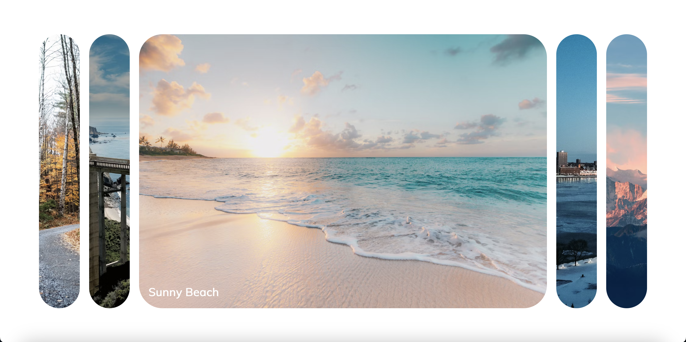
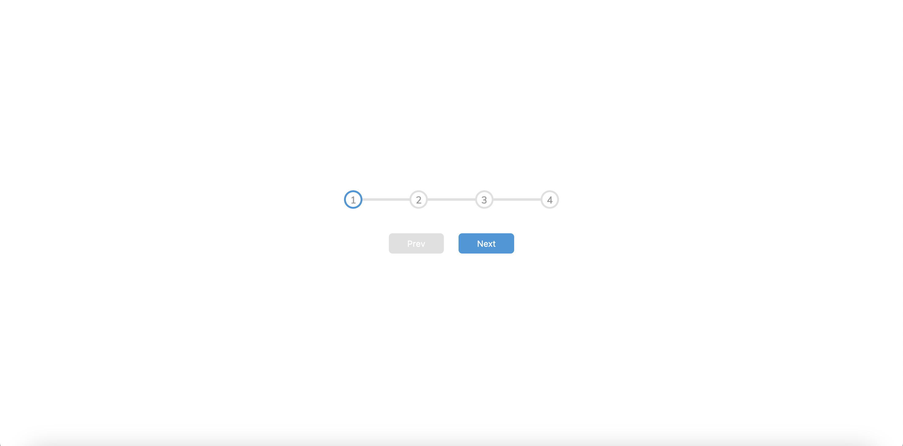
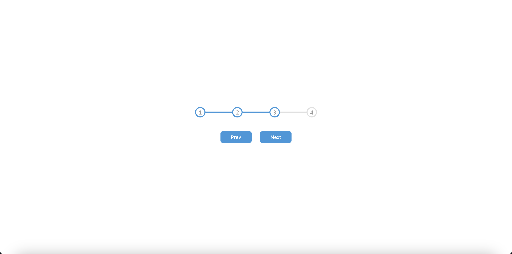
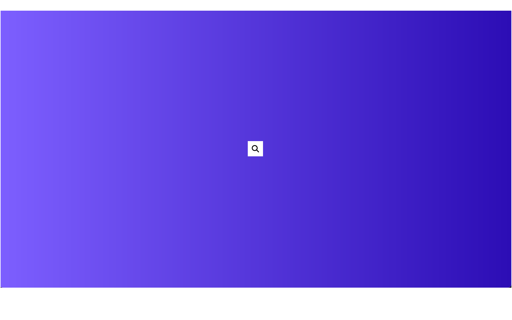
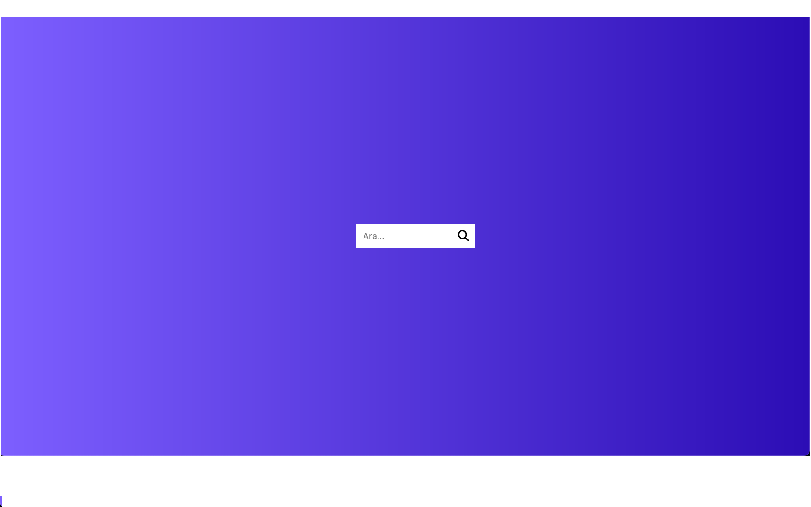

# 50 Günde 50 JavaScript Projesi 
[Kaynak](https://www.udemy.com/course/50-projects-50-days/)

## 1. Proje: Expanding Cards
### Projenin Bana Kattıkları
+ Çeşitli CSS Özellikleri
+ JavaScript ile DOM'a Erişmek ve Etkileşimde Bulunmak
+ JavaScript ile HTML Class yapılarında değişikliğe gitmek

## 2. Proje: Progress Steps
### Projenin Bana Kattıkları
+ forEach Döngüsü
+ JavaScript ile CSS'e Erişmek

## 3. Proje: Rotating Animation

## 4. Proje: Hidden Search
+ toggle & focus

